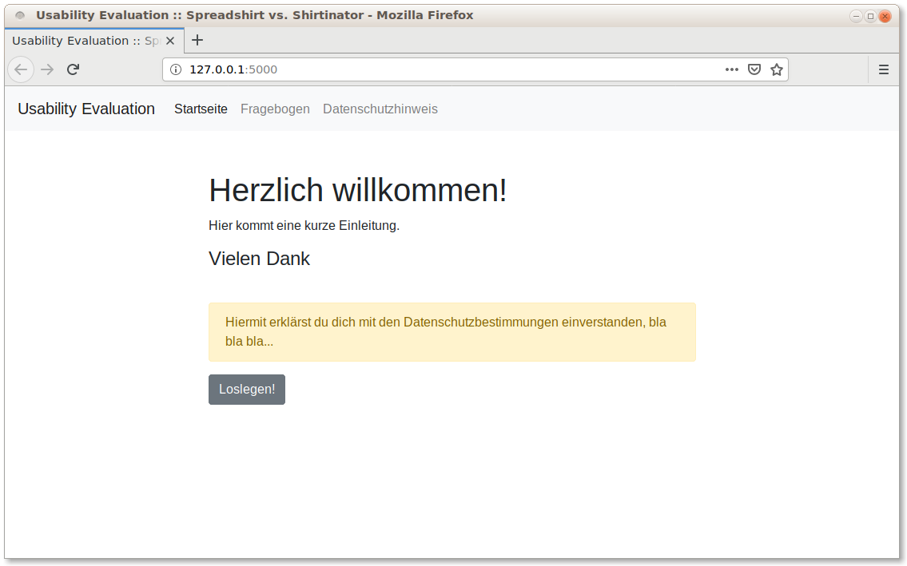
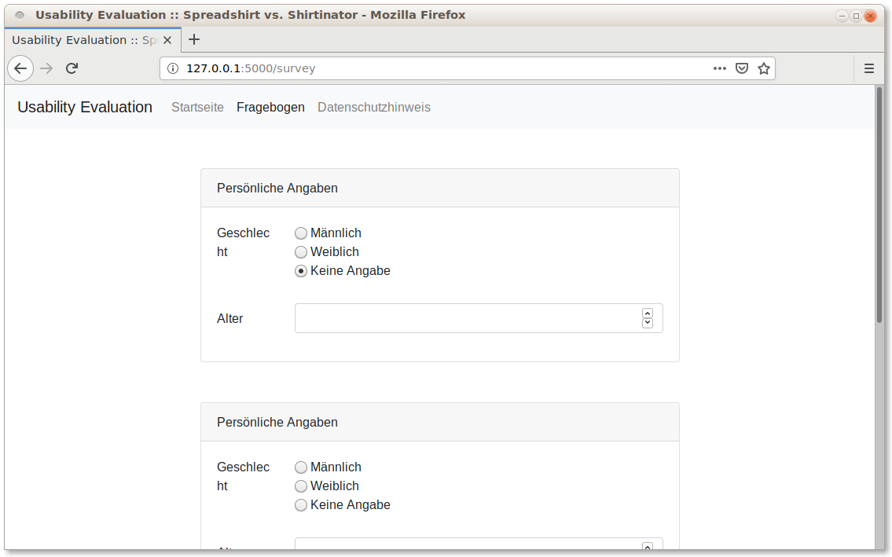

## Installation
[Pipenv](https://pipenv.readthedocs.io/en/latest/) automatically creates and manages a virtualenv for this project. Installation as usual:

```
$ pip install pipenv
```

To install the _project’s dependencies_:

```
$ pipenv install
```

You can spawn a shell:

```
$ pipenv shell
```

or a command installed into the virtual environment, for example to run the application:

```
$ pipenv run python usability-survey.py
```

## Interface


